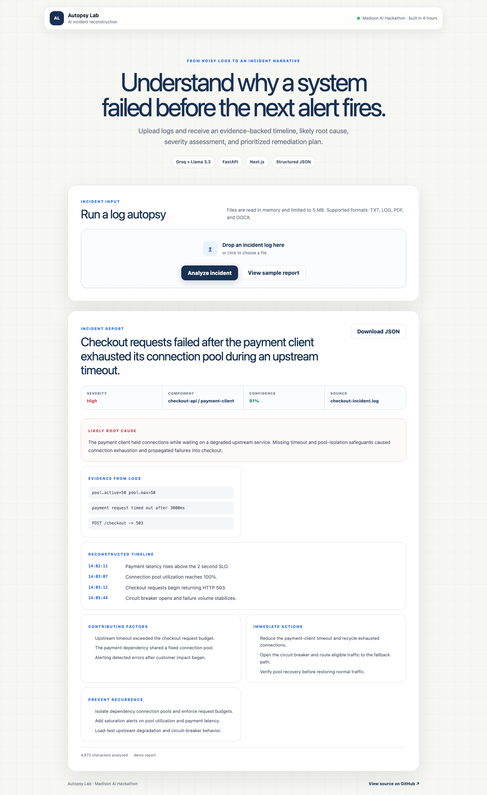

# Autopsy Lab

**AI-assisted incident reconstruction for raw system logs.**

Autopsy Lab turns an uploaded log file into a structured incident report: severity, affected component, event timeline, likely root cause, supporting evidence, immediate mitigation, and preventive actions.

> Built as a working prototype in **four hours** at the Madison AI Hackathon, then hardened for public review with safer file handling, structured validation, tests, CI, Docker support, and a responsive product interface.

[](https://autopsy-lab.vercel.app)

[](https://nextjs.org/)
[](https://fastapi.tiangolo.com/)
[](https://groq.com/)
[](https://github.com/srashtigupta-25/hackathon-1/actions)



## Why this project matters

Production incidents rarely arrive as clean narratives. Engineers receive fragmented timestamps, stack traces, retries, timeouts, and downstream failures. Autopsy Lab helps organize that evidence without pretending the model is an authority:

- separates likely root cause from symptoms;
- grounds conclusions in extracted log evidence;
- assigns confidence based on ambiguity;
- produces immediate and long-term remediation paths;
- preserves a structured JSON report for sharing or downstream automation.

## Product walkthrough

1. Upload a `.txt`, `.log`, `.pdf`, or `.docx` file.
2. FastAPI validates the extension and size, then extracts text in memory.
3. The input is bounded before being sent to Groq.
4. Llama 3.3 produces a strict JSON incident model.
5. Pydantic validates every field before the response reaches the UI.
6. Next.js renders an accessible, responsive report that can be downloaded as JSON.

```text
Log file
   |
   v
FastAPI validation and extraction
   |
   v
Bounded prompt + Groq / Llama 3.3
   |
   v
Pydantic schema validation
   |
   v
Next.js incident report
```

## What the report contains

| Section | Purpose |
|---|---|
| Incident summary | One-sentence description of customer or system impact |
| Severity | Critical, high, medium, or low |
| Affected component | Most likely service or subsystem |
| Timeline | Ordered events with supplied timestamps where available |
| Root cause | Underlying failure separated from visible symptoms |
| Evidence | Concise signals taken from the uploaded logs |
| Contributing factors | Conditions that amplified the incident |
| Immediate actions | Ordered mitigation steps |
| Preventive actions | Reliability improvements to prevent recurrence |
| Confidence | A bounded score reflecting evidence quality |

## Engineering decisions

### Evidence before certainty

The prompt instructs the model not to invent infrastructure or timestamps. The response separates evidence, contributing factors, and inferred root cause so uncertainty stays visible.

### Structured output

The backend requests JSON output and validates it against typed Pydantic models. Invalid model responses fail closed with a clear API error instead of leaking malformed data into the frontend.

### Safer uploads

- 5 MB default upload limit
- allowlisted file extensions
- filename sanitization
- in-memory PDF and DOCX parsing
- bounded log context
- no uploaded files persisted to disk

### Usable without an API key

The frontend includes a sample incident report so reviewers can inspect the complete experience without configuring Groq.

## Technology

| Layer | Technology |
|---|---|
| Frontend | Next.js 16, React 19, TypeScript, responsive CSS |
| Backend | FastAPI, Python 3.12, Pydantic |
| AI | Groq API, Llama 3.3 70B |
| Parsing | chardet, pypdf, python-docx |
| Quality | pytest, Playwright, ESLint, GitHub Actions |
| Packaging | Docker, Docker Compose |

## Run locally

### Prerequisites

- Node.js 22+
- Python 3.12+
- Groq API key for live analysis

### 1. Configure the environment

```bash
cp .env.example .env
```

Set `GROQ_API_KEY` in `.env`. Never commit the file.

Create `frontend/.env.local`:

```bash
NEXT_PUBLIC_API_URL=http://localhost:8000
```

### 2. Start the backend

```bash
cd backend
python -m venv .venv
source .venv/bin/activate
pip install -r requirements.txt
export GROQ_API_KEY="your_key"
uvicorn main:app --reload
```

API documentation is available at [http://localhost:8000/docs](http://localhost:8000/docs).

### 3. Start the frontend

```bash
cd frontend
npm install
npm run dev
```

Open [http://localhost:3000](http://localhost:3000).

### Docker Compose

```bash
GROQ_API_KEY="your_key" docker compose up --build
```

### Vercel

The repository is configured as one Vercel Services project:

- Next.js frontend at `/`
- FastAPI backend at `/api`
- automatically generated `NEXT_PUBLIC_BACKEND_URL=/api`

**Production:** [autopsy-lab.vercel.app](https://autopsy-lab.vercel.app)

After importing the repository, select the **Services** framework preset and add
`GROQ_API_KEY` as a production environment variable. Vercel builds both services
and serves them from the same deployment domain.

## API

### `POST /analyze`

Multipart form field: `log_file`

Success response:

```json
{
  "analysis": {
    "incident_summary": "Checkout requests failed after connection exhaustion.",
    "severity": "high",
    "affected_component": "checkout-api / payment-client",
    "timeline": [
      {
        "timestamp": "14:03:12",
        "event": "Checkout requests begin returning HTTP 503."
      }
    ],
    "root_cause": "A degraded dependency exhausted the shared connection pool.",
    "contributing_factors": ["Timeout exceeded the request budget."],
    "evidence": ["pool.active=50 pool.max=50"],
    "immediate_actions": ["Open the circuit breaker."],
    "preventive_actions": ["Isolate dependency connection pools."],
    "confidence_score": 91
  },
  "metadata": {
    "filename": "checkout.log",
    "characters_analyzed": 4872,
    "truncated": false,
    "model": "llama-3.3-70b-versatile"
  }
}
```

Other endpoints:

- `GET /health` - service and AI configuration status
- `GET /docs` - interactive OpenAPI documentation

## Tests

```bash
cd backend
pip install -r requirements-dev.txt
pytest -q

cd ../frontend
npm run lint
npm run build
npm run test:e2e
```

GitHub Actions runs both suites on every push and pull request.

## Repository structure

```text
.
├── .github/workflows/ci.yml
├── backend/
│   ├── main.py
│   ├── test_main.py
│   ├── requirements.txt
│   └── Dockerfile
├── frontend/
│   ├── src/app/
│   │   ├── layout.tsx
│   │   ├── page.tsx
│   │   └── globals.css
│   ├── package.json
│   └── Dockerfile
├── .env.example
└── docker-compose.yml
```

## Limitations and next steps

This remains a hackathon prototype, not an autonomous incident-management system.

- LLM output should be reviewed by an engineer before acting.
- Large or multi-service incidents need chunking and cross-file correlation.
- Production deployment should add authentication, rate limiting, request tracing, encrypted storage policies, and provider-level observability.
- A next iteration could integrate OpenTelemetry traces, log-platform connectors, incident history, and evaluation datasets.

## Security note

If an API credential has ever been committed, removing it from the latest source is not enough. Revoke it at the provider and issue a new key. Keep all local credentials in ignored environment files.

## Author

Built by [Srashti Gupta](https://github.com/srashtigupta-25) at the Madison AI Hackathon.
